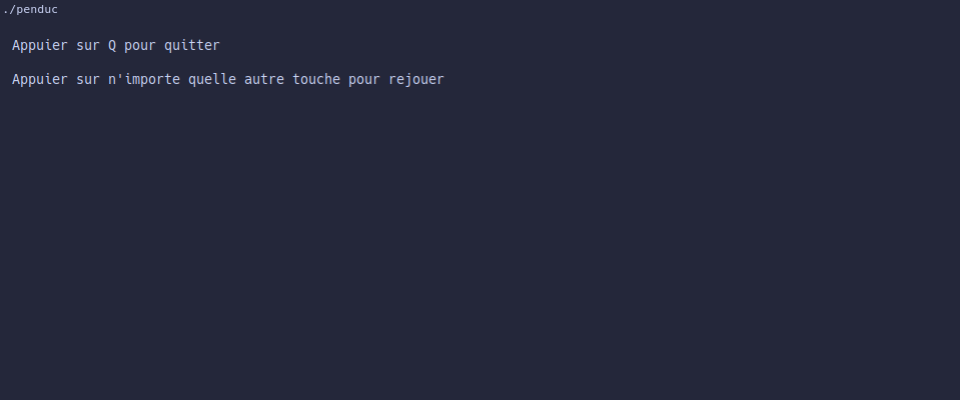

# penduc

**penduc** is a simple terminal-based Hangman (*Jeu du Pendu*) game written in C using `ncurses`.

## Features

- **3 Difficulty Levels**:
  - **Facile (Easy)**: 5-letter words
  - **Moyenne (Medium)**: 7-letter words
  - **Difficile (Hard)**: 10-letter words
- **Interactive TUI**: ASCII hangman drawing that updates with each incorrect guess and tracks tried letters.
- **Replay Support**: Play multiple rounds in a single session.

## Screenshots

| Difficulty Selection | Gameplay |
| :---: | :---: |
|  |  |

| Hanging Progression | Game Over |
| :---: | :---: |
|  |  |

## Prerequisites

You will need a C compiler (`gcc`) and the `ncurses` development library:

- **Debian / Ubuntu**:
  ```bash
  sudo apt install gcc libncurses-dev
  ```
- **Arch Linux**:
  ```bash
  sudo pacman -S gcc ncurses
  ```
- **Fedora**:
  ```bash
  sudo dnf install gcc ncurses-devel
  ```
- **macOS** (Homebrew):
  ```bash
  brew install ncurses
  ```

## Installation & Running

1. **Clone the repository**:
   ```bash
   git clone https://github.com/eliott-wnr/penduc.git
   cd penduc
   ```

2. **Compile the program**:
   ```bash
   gcc src/*.c -lncurses -o penduc
   ```

3. **Run**:
   ```bash
   ./penduc
   ```

> **Note**: Make sure to run `./penduc` from the project root directory so it can locate the word files inside `files/`.
